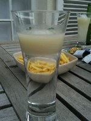

Octobre 
=========

**Viendez, viendez nombreux à l'afpyro national le jeudi 14 octobre 2010 à 19h**

Le dernier AFpyro a eu lieu lors de PyCon-fr. Et le moins que l'on puisse dire c'est que c'était plutot magique.

On y a entendu de tout ! Des conversations sur le cloud, de pourquoi les gens développaient en Python jusqu'à la façon de servir des pastis aériens avec antigravity.

Un ami du sud-est que je ne nommerais pas (il organise les afpyros à Nice, ne voulait pas croire un gars du sud-ouest sur une autre façon de servir le pastis .

Jusqu'à ce qu'il tape ça dans son interpréteur :

::
    
    >>> from afpyro import antigravity                                  
    >>> antigravity.pastis()                                                     
    'http://www.afpy.org/Members/jpcw2002/pastis_moleculaire/image_view'

    >>> # toi aussi tu sais faire des trucs magiques en afpyro                                        
    >>> # alors viens les présenter

Pau
----
au club d'échecs Henri IV 

39 ter rue E. Guichenné 64000 PAU

`Plan OSM`_ 

Paris
------
Café Chéri(e)

44 bd de la Villette, 75019 Paris (FR).

M°: Belleville /Colonel Fabien

Toulouse
----------

.. warning:: A Toulouse c'est le **mardi 12 à 19:30**

Lieu: `De Danú Irish Bar`_ 

Il y a la possibilité de manger sur place (ce n'est pas obligatoire), mais une inscription sur la page web de `Toulibre`_ est nécessaire pour faire la réservation. Indiquez dans l'inscription si vous allez manger ou pas.

La `carte du repas`_

merci à Nekrodes

.. _`Plan OSM`: http://www.openstreetmap.org/?lat=43.29864&lon=-0.368015&zoom=16&layers=0B00FTFT
.. _`De Danú Irish Bar`: http://www.dedanu.com/index.php?id=2
.. _`carte du repas`: http://www.dedanu.com/index.php?id=4                                                              
.. _`Toulibre`: http://toulibre.org/afpyro
